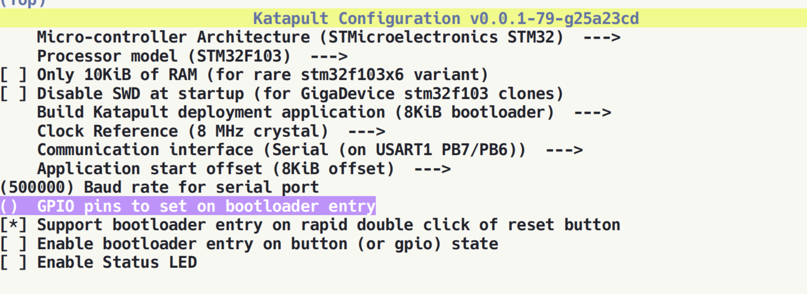

# Flashing Notes
Flashing the plus 4 is hitting both the toolhead and the SOC board. The toolhead is 
certainly the more difficult one to flash as it requires some simply soldering and
using an ST Link V2 programmer. The SOC board is vastly easier and simply requires an
SD card.

## Flashing the toolhead
You'll need a 6 pin header to solder to toolhead board to the j1 location. Be sure to observe the pin 1 orientation on the board in the top right corner. 

To wire up the board, you'll need 6 wires, 12 single female dupont connectors, 6 single plastic housings, 6 pin plastic housing, and 1 male dupont connector. The one male connector is so you can push either pin 1 wire or pin 19 wire from the stlink v2 into the top of the pin 2 on the plastic housing that willconnect to j1 on the toolhead pinheader. Article explaining symptons of the not having these two lines joined can be read [here](https://community.st.com/t5/stm32cubeprogrammer-mcus/i-can-t-write-to-my-stm32g03-when-connect-in-hot-plug-mode-and-i/td-p/170595).

### Katapult & Klipper Settings
Katapult


Klipper


### Flashing Katapult
This part may be possible on a stock qidi plus 4 install, but the assumption here is that you have installed a modern armbian. With that said, install the stlink-tools package:  
```
sudo apt install stlink-tools
```

Once complete, plug your promgrammer into the USB port on the top of the qidi and run an stlink to verify it's found:

```
mks@qidi-plus4:~$ lsusb
Bus 003 Device 001: ID 1d6b:0003 Linux Foundation 3.0 root hub
Bus 002 Device 004: ID 1d50:614e OpenMoko, Inc. stm32h723xx
Bus 002 Device 001: ID 1d6b:0002 Linux Foundation 2.0 root hub
Bus 005 Device 001: ID 1d6b:0001 Linux Foundation 1.1 root hub
Bus 004 Device 006: ID 0735:0269 Asuscom Network 
Bus 004 Device 005: ID 0483:3748 STMicroelectronics ST-LINK/V2
Bus 004 Device 004: ID 1a40:0101 Terminus Technology Inc. Hub
Bus 004 Device 001: ID 1d6b:0002 Linux Foundation 2.0 root hub
Bus 001 Device 001: ID 1d6b:0002 Linux Foundation 2.0 root hub
```
You should see the stlink device in the list of usb devices.

Next, make sure the st link tools are working by checking your programmer:
```
mks@qidi-plus4:~$ st-info --probe
Found 1 stlink programmers
  version:    V2J45S7
  serial:     32FF6B063051563958342143
  flash:      0 (pagesize: 0)
  sram:       0
  chipid:     0x0000
  descr:      unknown device
```

Once your output matches what you have here, it's safe to say that you programmer is connected and working as expected. Unplug and proceed to wiring.

### Wiring Diagram
```
+-------- J1 6-Pin Connector --------+            +---------- STLink V2 20-Pin Connector -----------+
|                                    |            |                                                 |
| Pin 1: DIO   ----------------------|------------| Pin 7: SWDIO / TMS7                             |
| Pin 3: CLK   ----------------------|------------| Pin 9: SWCLK / TCK9                             |
| Pin 5: RST   ----------------------|------------| Pin 15: MCU RST                                 |
| Pin 6: GND   ----------------------|------------| Pin 12: GND                                     |
| Pin 4: GND                         |            |                                                 | 
| Pin 2: 3V3   ----------------------|---+--------| Pin 1: VDD                                      |
|                                    |   |        |                                                 |
|                                    |   |--------| Pin 19: VDD                                     |
+------------------------------------+            +-------------------------------------------------+

```

### Flashing katapult
Build katapult with the settings above.

Ensure you plug in the 6pin connector to the toolhead pinheader with the correct orientation. You don't want to send 3.3v to places it doesn't belong!

With that said, plug in all of the wiring from the programmer to the pinheader. I found that you didn't have to enter dfu mode with the programmer, simply run the following command:

```
mks@qidi-plus4:~/katapult$ st-flash write out/katapult.bin 0x8000000
st-flash 1.7.0
2025-01-27T22:59:31 INFO common.c: F1xx High-density: 64 KiB SRAM, 128 KiB flash in at least 2 KiB pages.
file out/katapult.bin md5 checksum: ff798a9a344c4de2679164e815f49ca, stlink checksum: 0x00044bf7
2025-01-27T22:59:31 INFO common.c: Attempting to write 3063 (0xbf7) bytes to stm32 address: 134217728 (0x8000000)
2025-01-27T22:59:31 WARN common.c: unaligned len 0xbf7 -- padding with zero
2025-01-27T22:59:31 INFO common.c: Flash page at addr: 0x08000000 erased
2025-01-27T22:59:31 INFO common.c: Flash page at addr: 0x08000800 erased
2025-01-27T22:59:31 INFO common.c: Finished erasing 2 pages of 2048 (0x800) bytes
2025-01-27T22:59:31 INFO common.c: Starting Flash write for VL/F0/F3/F1_XL
2025-01-27T22:59:31 INFO flash_loader.c: Successfully loaded flash loader in sram
2025-01-27T22:59:31 INFO flash_loader.c: Clear DFSR
  2/  2 pages written
2025-01-27T22:59:31 INFO common.c: Starting verification of write complete
2025-01-27T22:59:31 INFO common.c: Flash written and verified! jolly good!
```
Katapult is now flashed!

### Flashing klipper
Once you successfully flash katapult, double tap the reset button the toolhead to put it into bootloader mode. Build your klipper with the config from above and then run the following and look for similar output:

```  
mks@qidi-plus4:~$ cd katapult/scripts/
mks@qidi-plus4:~/katapult/scripts$ python3 flashtool.py -b 500000 -d /dev/ttyS2 -f ~/klipper/out/klipper.bin
Flashing Serial Device /dev/ttyS2, baud 500000
Attempting to connect to bootloader
Katapult Connected
Software Version: v0.0.1-79-g25a23cd
Protocol Version: 1.1.0
Block Size: 64 bytes
Application Start: 0x8002000
MCU type: stm32f103xe
Flashing '/home/mks/klipper/out/klipper.bin'...

[##################################################]

Write complete: 33 pages
Verifying (block count = 514)...

[##################################################]

Verification Complete: SHA = 17F568DAD314AA754EE8E6E5D40B1921E30BDB34
Flash Success  
```
Klipper is now flashed to the toolhead! 
